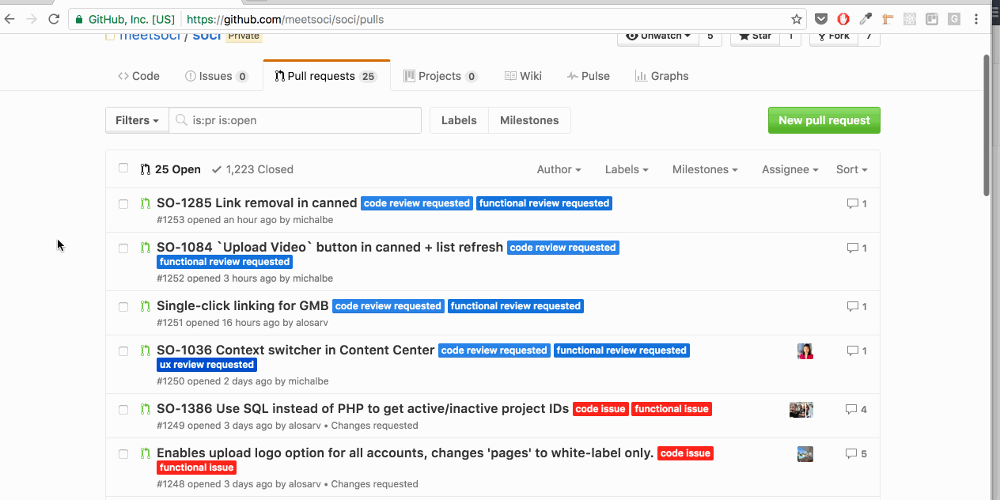
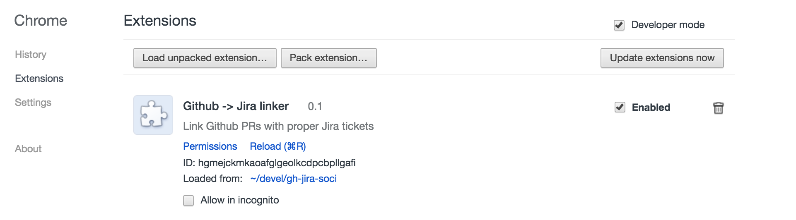
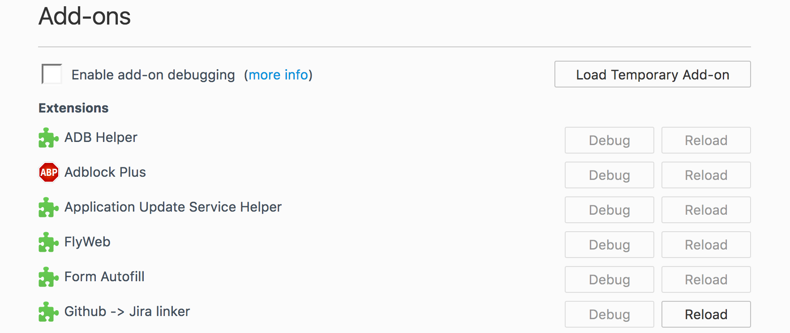

# GH -> Jira

This Mozilla Firefox/Google Chrome Add-on changes ticket numbers in PRs' titles to links to proper Jira tickets. I personally find it helpful when reviewing tasks, so I don't need to copy/paste anything.



## Instalation

  - Clone/download this repo

## Configuration

  - Put proper Jira ticket labels and Jira url in `script.js:CONFIG`:
  - If your tickets use `MY_COMPANY-2023` notation, and your Jira instance runs on `http://my_company.atlassian.net`, then the `CONFIG` const should look like this:
  ```js
  const CONFIG = {
    jira_url: 'https://my_company.atlassian.net/browse/', // <- note the `/browse` part here
    ticket_label: 'MY_COMPANY-' // <- note the dash here
  }
  ```

### Google Chrome

  - Go to `chrome://extensions/`
  - Click `Load unpacked exptension`
  - Choose the folder where `gh-jira` was downloaded
  - Go to your pull request page (usually something like `https://github.com/your_name/your_remo/pulls`) and refresh



### Mozilla Firefox

  - Go to `about:debugging` page
  - Click `Load Temporary Add-on`
  - Choose the `manifest.json` file from the downloaded repo
  - Go to your pull request page (usually something like `https://github.com/your_name/your_remo/pulls`) and refresh
  - Note that this will work only till Firefox will be restarted (what probably doesn't occur often for us developers)


